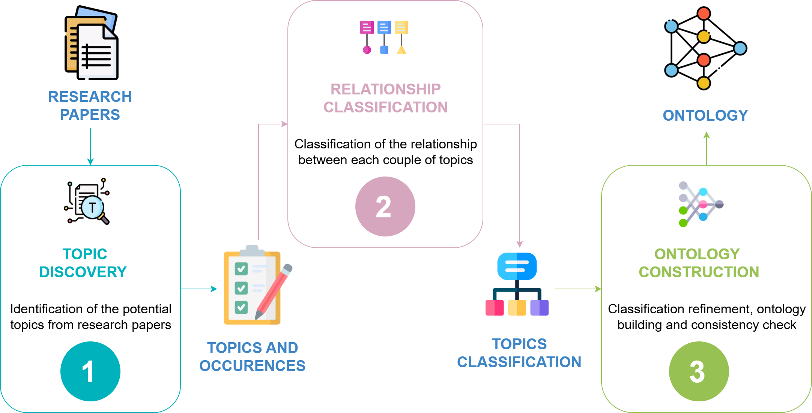

**A Hybrid AI Methodology for Generating Ontologies of Research Topics from Scientific Paper Corpora**  
by *Alessia Pisu, Livio Pompianu, Francesco Osborne, Diego Reforgiato Recupero, Daniele Riboni, Angelo Salatino*

## Abstract
Modern AI systems offer tools for literature search, automated reviews, hypothesis generation, and more. However, managing the increasing volume of academic publications produced each year continues to pose a significant challenge. Large Language Models (LLMs) have revolutionised text processing, but struggle with synthesising and navigating the structure of entire research fields.
To address this challenge, researchers have proposed developing structured, interlinked, and formal representations of the content of research publications, enabling more effective ingestion by AI systems. Among the various dimensions for describing the content of a research paper, the most fundamental is the research topic. Therefore, taxonomies and ontologies of research topics (e.g., MeSH, UMLS, CSO, NLM) play a central role in providing the primary framework through which intelligent systems can explore and interpret the literature.
However, these resources have traditionally been manually curated, a process that is time-consuming, prone to obsolescence, and limited in granularity. 

This paper presents **Sci-OG**, a semi-automated methodology for generating research topic ontologies, employing a multi-step approach: 
1. Topic Discovery, extracting potential topics from research papers;
2. Relationship Classification, determining semantic relationships between topic pairs; 
3. Ontology Construction, refining and organizing topics into a structured ontology. 

The relationship classification component, which constitutes the core of the system, integrates an encoder-based language model with features describing topic occurrence in the scientific literature. We evaluate this approach against a range of alternative solutions using a dataset of 21,649 manually annotated semantic triples. Our method achieves the highest F1 score (0.951), surpassing various competing approaches, including a fine-tuned SciBERT model and several LLM baselines, such as the fine-tuned GPT4-mini. 
Our work is corroborated by a use case which illustrates the practical application of our system to extend the CSO ontology in the area of cybersecurity.
The presented solution is designed to improve the accessibility, organization, and analysis of scientific knowledge, thereby supporting advancements in AI-enabled literature management and research exploration.

## About
**Sci-OG** (Scientific Ontology Generator) is a modular AI pipeline for the semi-automatic generation of ontologies of research topics from large-scale corpora of scientific literature.

It was developed to address the limitations of manual curation in existing taxonomies, offering a scalable and updateable solution based on modern NLP techniques.

The pipeline follows a three-stage architecture:

1. **Topic Discovery**  
   - Extracts candidate research topics using a fine-tuned BERT-based Named Entity Recognition (NER) model.
   - Operates on paper titles and abstracts to ensure scalability and generalizability.
   - Produces a list of topic mentions with occurrence and co-occurrence statistics.

2. **Relationship Classification**  
   - Classifies pairs of topics into semantic relations: `supertopic`, `subtopic`, `same-as`, or `other`.
   - Uses a hybrid method that combines:
     - A fine-tuned encoder-based model (SciBERT)
     - Statistical features from literature metadata (e.g., co-occurrence, subsumption score)
   - Trained and evaluated on a dedicated benchmark (CSO-21K).

3. **Ontology Construction**  
   - Aggregates classified relations into a structured, hierarchical ontology.
   - Resolves inconsistencies (e.g. loop detection, symmetry violations).
   - Optionally integrates expert feedback for final refinement.

